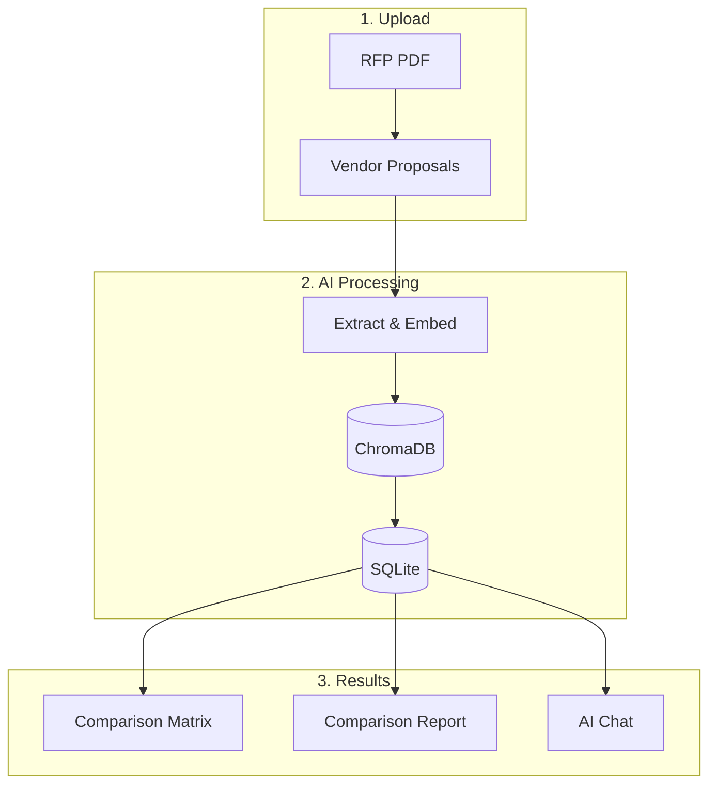

<div align="center">

# 🚀 Smart RFP System

### AI-Powered Procurement & Proposal Management Platform

[](https://react.dev/)
[](https://fastapi.tiangolo.com/)
[](https://www.python.org/)
[](https://openai.com/)

[**Documentation**](WORKFLOW.md) · [**Architecture**](docs/system-architecture.md)

---

[](https://drive.google.com/file/d/1p7Qom6bnGoPnj_k_okydY2Aqj_r7k1W0/view?usp=sharing)

*👆 Click to watch full demo*

</div>

---

## 📋 Overview

**Smart RFP System** transforms manual, error-prone procurement processes into instant, data-driven decisions using state-of-the-art AI. Upload vendor proposal PDFs and let AI automatically extract, compare, and visualize contractor data—no manual data entry required.



---

## ✨ Key Features

| Feature | Description |
|---------|-------------|
| **📄 AI PDF Extraction** | Automatically extract contractor details, pricing, timelines, experience, materials, warranties, and line-item breakdowns from proposal PDFs |
| **📋 Dynamic Form Discovery** | AI discovers RFP proposal form structure and extracts matching data from each vendor for apples-to-apples comparison |
| **💬 Proposal Chat Assistant** | Ask natural language questions about any proposal with full context of vendor data and RFP requirements |
| **⚖️ Comparison Matrix** | Side-by-side vendor comparison with automatic column classification and grand total calculations |
| **📊 Visual Analytics** | Radar charts, bar charts, and scoring tables to visualize the "Best Fit" vendor across multiple dimensions |
| **🎯 RFP Lifecycle Dashboard** | Track Open RFPs, Drafts, Saved Comparisons, and recent activity in one unified interface |

---

## 🛠️ Tech Stack

### Frontend


### Backend


### AI Models
| Component | Model | Purpose |
|-----------|-------|---------|
| **Chat & Extraction** | `gpt-4o` | Structured data extraction, proposal chat |
| **Embeddings** | `text-embedding-3-large` | Document vectorization (3072 dimensions) |
| **Fallback** | Groq (optional) | Backup if OpenAI unavailable |

---

## 🚀 Quick Start

### Prerequisites
- **Node.js** v18+
- **Python** v3.10+
- **OpenAI API Key** (required)

### 1. Clone & Setup Backend

```bash
# Clone the repository
git clone https://github.com/saim-honey388/smart-rfp-system.git
cd smart-rfp-system

# Create virtual environment
python3 -m venv .venv
source .venv/bin/activate

# Install dependencies
pip install -r requirements.txt

# Start the API server
uvicorn backend.main:app --host 0.0.0.0 --port 8000 --reload
```

### 2. Setup Frontend

```bash
# In a new terminal
cd frontend
npm install
npm run dev
```

### 3. Configure Environment

Create a `.env` file in the project root:

```bash
# Database
DATABASE_URL=sqlite:///./rfp.db
STORAGE_PATH=storage

# Required: OpenAI
OPENAI_API_KEY=sk-your-key-here
OPENAI_MODEL=gpt-4o
OPENAI_EMBEDDING_MODEL=text-embedding-3-large

# Optional: Fallback
GROQ_API_KEY=gsk-your-groq-key
USE_FALLBACK_PROVIDER=false
```

> [!IMPORTANT]
> A valid `OPENAI_API_KEY` is required for AI extraction and chat features.

### 4. Access the Application

| Service | URL |
|---------|-----|
| **Frontend** | http://localhost:5173 |
| **API Docs** | http://localhost:8000/docs |

---

## �️ Architecture

```
/RFP System
├── backend/                    # Python/FastAPI backend
│   ├── main.py                 # Application entrypoint
│   ├── routers/                # API route handlers
│   ├── services/               # Business logic layer
│   │   ├── ingest/             # PDF extraction services
│   │   └── review/             # AI review & scoring
│   └── src/agents/             # AI agent components
├── frontend/                   # React + Vite frontend
│   ├── src/components/         # React components
│   └── src/pages/              # Page components
├── data/chromadb/              # Vector database for embeddings
└── storage/proposals/          # Uploaded proposal PDFs
```

> For complete architecture details, see [`docs/system-architecture.md`](docs/system-architecture.md)

---

## 🔌 API Reference

| Method | Endpoint | Description |
|--------|----------|-------------|
| `GET` | `/api/rfps` | List all RFPs |
| `POST` | `/api/rfps` | Create new RFP |
| `POST` | `/api/rfps/upload` | Upload RFP PDF |
| `POST` | `/api/proposals/upload` | Upload proposal PDF |
| `POST` | `/api/proposals/{id}/approve` | Approve proposal |
| `POST` | `/api/proposals/{id}/reject` | Reject proposal |
| `GET` | `/api/proposals/{rfp_id}/matrix` | Get comparison matrix |
| `POST` | `/api/chat/proposal` | Chat about a proposal |

> Full API documentation available at `http://localhost:8000/docs` when running locally.

---

## 📖 Documentation

| Document | Description |
|----------|-------------|
| [**WORKFLOW.md**](WORKFLOW.md) | Complete user journey and demo walkthrough |
| [**System Architecture**](docs/system-architecture.md) | Technical architecture, data models, and API endpoints |

---

## 📞 Contact

**Saim Khalid** – [saim.khalid983@gmail.com](mailto:saim.khalid983@gmail.com)

[](https://github.com/saim-honey388)

---

<div align="center">

*Streamlining procurement decisions with intelligent automation*

</div>
