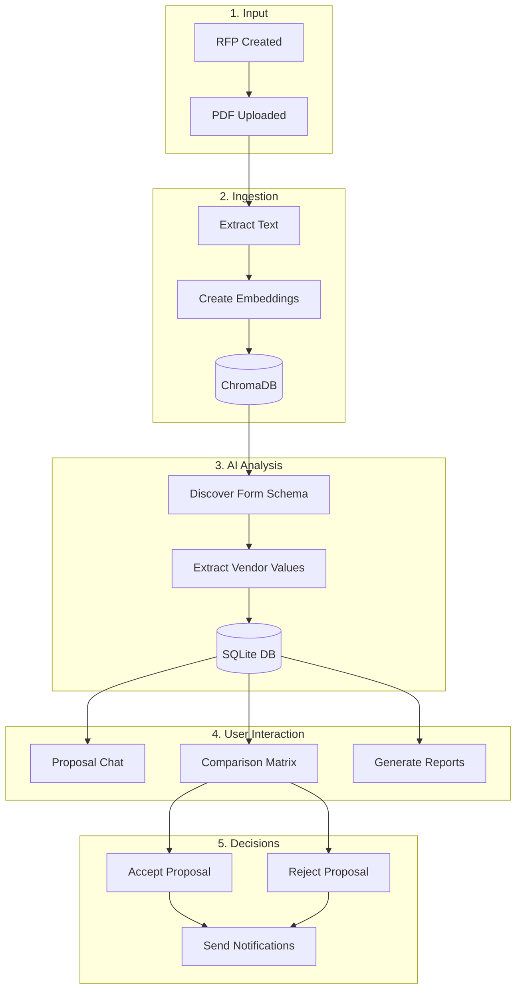

# Smart RFP System - System Architecture

This document describes the system architecture, directory structure, and data flow of the Smart RFP System.

---

## Goals
- Let requestors upload/create RFPs with requirements and deadlines
- Let contractors submit proposals (PDF files + structured fields)
- AI-powered extraction: automatically parse PDFs for pricing, timelines, experience, materials, warranties
- AI-powered chat: ask questions about any proposal with full context
- Side-by-side vendor comparison with dynamic column classification
- Visual analytics with radar charts and scoring tables
- Automated pipeline: review, compare, approve/reject, and notify

---

## Directory Structure

```
/RFP System
├── backend/                    # All backend code (Python/FastAPI)
│   ├── main.py                 # FastAPI application entrypoint
│   ├── config/
│   │   └── settings.py         # Environment and configuration
│   ├── models/
│   │   ├── db.py               # SQLite database connection
│   │   └── entities.py         # SQLAlchemy ORM models
│   ├── routers/                # API route handlers
│   │   ├── rfps.py             # RFP CRUD endpoints
│   │   ├── proposals.py        # Proposal upload & management
│   │   ├── comparisons.py      # Saved comparison endpoints
│   │   ├── chat.py             # Proposal chat endpoints
│   │   ├── analysis.py         # AI analysis endpoints
│   │   └── reviews.py          # Review & scoring endpoints
│   ├── schemas/                # Pydantic request/response models
│   │   ├── rfp.py
│   │   ├── proposal.py
│   │   ├── chat.py
│   │   └── review.py
│   ├── services/               # Business logic layer
│   │   ├── rfp_service.py      # RFP operations
│   │   ├── proposal_service.py # Proposal operations
│   │   ├── chat_service.py     # AI chat with proposals
│   │   ├── review_service.py   # AI review & scoring
│   │   ├── report_generator.py # Excel/report generation
│   │   ├── column_classifier.py # Matrix column classification
│   │   ├── ingest/             # PDF extraction services
│   │   │   ├── extractor.py    # PDF text extraction
│   │   │   ├── parser.py       # Email/data parsing
│   │   │   ├── ai_extractor.py # AI-powered detail extraction
│   │   │   ├── rfp_extractor.py # RFP metadata extraction
│   │   │   └── prompts/        # Extraction prompt templates
│   │   └── review/
│   │       └── prompts/        # Review prompt templates
│   └── src/
│       ├── agents/             # AI agent components
│       │   ├── form_structure_analyzer.py  # Discover proposal form schema
│       │   ├── vendor_data_extractor.py    # Extract vendor bid form data
│       │   ├── comparison_matrix_builder.py # Build comparison matrices
│       │   ├── form_generator.py           # Generate blank forms
│       │   ├── bid_estimator.py            # Price estimation
│       │   ├── rfp_architect.py            # RFP requirement generation
│       │   └── ingestion.py                # ChromaDB document ingestion
│       └── utils/
│           ├── ai_client.py    # Unified AI client (OpenAI/Groq fallback)
│           ├── embeddings.py   # Text embedding functions
│           └── llm_client.py   # LLM completion wrapper
├── frontend/                   # React + Vite frontend
│   ├── src/
│   │   ├── components/         # React components
│   │   ├── context/            # React context (RFPContext)
│   │   ├── pages/              # Page components
│   │   └── App.jsx             # Main application
│   └── package.json
├── data/                       # Local data storage
│   └── chromadb/               # Vector database for embeddings
├── storage/                    # File storage
│   └── proposals/              # Uploaded proposal PDFs
├── jobs/                       # Scheduled background jobs
│   ├── expire.py               # Auto-expire RFPs
│   └── reminders.py            # Deadline reminders
├── docs/                       # Documentation
├── .env                        # Environment variables
├── requirements.txt            # Python dependencies
├── rfp.db                      # SQLite database
├── README.md
└── WORKFLOW.md
```

---

## AI Models & Configuration

| Component | Model | Purpose |
|-----------|-------|---------|
| **Chat & Extraction** | `gpt-4o` | Structured data extraction, proposal chat |
| **Embeddings** | `text-embedding-3-large` | Document vectorization (3072 dimensions) |
| **Fallback** | Groq (optional) | Backup if OpenAI unavailable |

Environment variables (`.env`):
```bash
OPENAI_API_KEY=sk-...
OPENAI_MODEL=gpt-4o
OPENAI_EMBEDDING_MODEL=text-embedding-3-large
GROQ_API_KEY=gsk-...  # Optional fallback
USE_FALLBACK_PROVIDER=false
```

---

## Data Flow Pipeline



---

## Key Data Models

### RFP (Request for Proposal)
```python
RfpModel:
    id: str (UUID)
    title: str
    description: str
    budget: int
    deadline: date
    status: str  # "draft" | "open" | "closed"
    requirements: JSON  # [{id, text}]
    proposal_form_schema: JSON  # Discovered form structure
    proposal_form_rows: JSON    # Line items from RFP
```

### Proposal
```python
ProposalModel:
    id: str (UUID)
    rfp_id: str (FK)
    contractor: str
    price: float
    status: str  # "submitted" | "Accepted" | "Rejected"
    extracted_text: str
    
    # AI-extracted fields (JSON arrays)
    experience: List[str]
    materials: List[str]
    timeline: List[str]
    warranty: List[str]
    cost_breakdown: List[str]
    
    # Vendor bid form data
    proposal_form_data: JSON  # [{item_id, description, quantity, unit_cost, total, ...}]
```

---

## API Endpoints

| Method | Endpoint | Description |
|--------|----------|-------------|
| `GET` | `/api/rfps` | List all RFPs |
| `POST` | `/api/rfps` | Create new RFP |
| `POST` | `/api/rfps/upload` | Upload RFP PDF |
| `GET` | `/api/proposals` | List proposals |
| `POST` | `/api/proposals/upload` | Upload proposal PDF |
| `POST` | `/api/proposals/{id}/approve` | Approve proposal |
| `POST` | `/api/proposals/{id}/reject` | Reject proposal |
| `GET` | `/api/proposals/{rfp_id}/matrix` | Get comparison matrix |
| `POST` | `/api/chat/proposal` | Chat about a proposal |
| `GET` | `/api/comparisons` | List saved comparisons |
| `POST` | `/api/comparisons` | Save comparison |

---

## Non-Functional Requirements

- **Simple Stack**: FastAPI + SQLite + React/Vite
- **Local First**: No Docker required, runs with Python venv
- **AI Fallback**: Automatic failover from OpenAI to Groq
- **Rate Limiting**: Built-in protections for API calls
- **Auditability**: Prompts and outputs stored with timestamps

---

## Quick Start

```bash
# Backend
python3 -m venv .venv
source .venv/bin/activate
pip install -r requirements.txt
uvicorn backend.main:app --host 0.0.0.0 --port 8000 --reload

# Frontend (separate terminal)
cd frontend
npm install
npm run dev
```

Access at: http://localhost:5173
